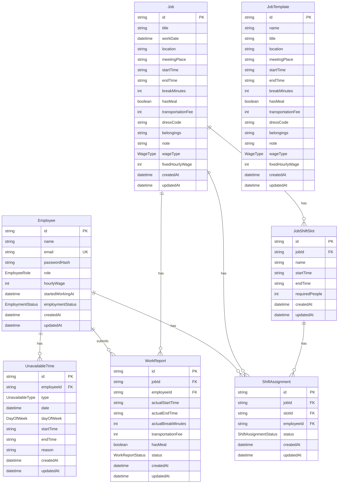

# Shift Manager

ケータリング現場向けのシフト管理アプリです。

案件ごとに勤務場所・勤務時間・必要人数が変わる業務に対応するため、案件・勤務枠・従業員・割当を分けて管理できるように設計しました。

---

## アプリ概要

Shift Manager は、ケータリング現場におけるシフト管理を支援するWebアプリケーションです。

一般的な店舗シフトのように「曜日ごとに誰が入るか」を管理するだけではなく、案件ごとに勤務場所・集合時間・勤務時間・必要人数が変わる働き方を想定しています。

管理者は案件や勤務枠を作成し、従業員を勤務枠に割り当てることができます。スタッフは自分の勤務予定や勤務不可情報を確認・登録できる構成を目指しています。

---

## リンク

- Demo: https://shift-manager-one-puce.vercel.app/
- GitHub: https://github.com/Anji0358/shift-manager
- Portfolio: https://anji0358.github.io/portfolio/

---

## 作成背景

ケータリングのアルバイトをしている中で、社員の方がスタッフ一人ひとりに個別で連絡を取りながらシフトを調整している様子を見て、「この負担を少しでも減らせないか」と考えたことが、Shift Manager を作成するきっかけです。

ケータリングの現場では、案件ごとに勤務場所・勤務時間・必要人数が変わります。そのため、一般的な曜日固定のシフト表だけでは、案件ごとの条件や人員の充足状況を管理しにくいという課題があります。

それまでは Java を中心に開発を学んでいましたが、次はフロントエンド開発に取り組みたいと考えていました。また、実際に使う人にとって分かりやすく、操作しやすい画面を作ることにも関心がありました。

以前の個人開発では、自分が「あったら便利」と思うものを中心に設計していました。しかし今回は、実際にシフト管理を行っている社員の方から、現在の管理方法、困っていること、必要としている機能を聞きながら要件を整理しました。

そのうえで、案件・勤務枠・従業員・シフト割当を分けて管理できる構成を考え、現場の働き方に合ったアプリケーションとして設計・開発しました。

---

## 解決したい課題

Shift Manager では、ケータリング現場のシフト管理における「個別連絡に依存した調整の負担」を主な課題として捉えました。

| 課題                                                               | 解決方針                                         |
| ------------------------------------------------------------------ | ------------------------------------------------ |
| 社員の方がスタッフ一人ひとりに個別連絡をしており、調整負担が大きい | 案件・勤務枠・割当状況を一元管理する             |
| 案件ごとに勤務場所・時間・必要人数が異なる                         | Job と JobShiftSlot を分けて管理する             |
| 必要人数に対して何人確定しているか分かりにくい                     | 勤務枠ごとに必要人数と割当人数を管理する         |
| スタッフ側も自分の勤務予定を確認しづらい                           | スタッフ用のシフト確認画面を用意する             |
| 管理者とスタッフで必要な情報が異なる                               | ロールに応じて管理者画面とスタッフ画面を分離する |

---

## 主な機能

### 管理者向け機能

- 案件の作成・編集・削除
- 勤務枠の管理
- 必要人数の設定
- 従業員情報の管理
- シフト割当
- 月別案件一覧
- 必要人数に対する充足状況の確認
- 勤務報告の確認

### スタッフ向け機能

- 自分のシフト確認
- 月別の勤務予定確認
- 勤務不可情報の登録
- 勤務報告の提出

### 共通機能

- ログイン機能
- 権限に応じた画面表示
- レスポンシブ対応
- ページ遷移時のローディング表示
- ボタン押下時のフィードバック表示

---

## 使用技術

| Category         | Technology                             |
| ---------------- | -------------------------------------- |
| Frontend         | Next.js, React, TypeScript             |
| Styling          | Tailwind CSS, shadcn/ui                |
| Backend          | Next.js Server Actions, Route Handlers |
| Database         | PostgreSQL                             |
| ORM              | Prisma                                 |
| Authentication   | Auth.js                                |
| Hosting          | Vercel                                 |
| Database Hosting | Neon                                   |
| Version Control  | Git, GitHub                            |

---

## 画面一覧

| 画面                     | 説明                                         |
| ------------------------ | -------------------------------------------- |
| ログイン画面             | 管理者・スタッフがログインする画面           |
| 管理者ダッシュボード     | 案件や割当状況を確認する画面                 |
| 案件一覧画面             | 月ごとの案件を確認する画面                   |
| 案件作成画面             | 新しい案件を登録する画面                     |
| 案件詳細画面             | 勤務枠、担当者、場所、メモなどを確認する画面 |
| 従業員管理画面           | 従業員の情報を管理する画面                   |
| シフト割当画面           | 勤務枠に従業員を割り当てる画面               |
| スタッフ用トップ画面     | スタッフが自分に関係する情報を確認する画面   |
| スタッフ用シフト確認画面 | 自分の勤務予定を確認する画面                 |
| 勤務不可情報登録画面     | 出勤できない日時を登録する画面               |
| 勤務報告画面             | 勤務実績を報告する画面                       |

---

## ER図・データ設計

Shift Manager では、ケータリング現場のシフト管理を、単なる予定表ではなく、以下の単位に分けて管理しています。

- 従業員情報を管理する `Employee`
- 案件情報を管理する `Job`
- 案件内の勤務枠を管理する `JobShiftSlot`
- 従業員の割当を管理する `ShiftAssignment`
- 勤務不可情報を管理する `UnavailableTime`
- 勤務実績を管理する `WorkReport`
- よく使う案件情報を再利用するための `JobTemplate`

ケータリング現場では、案件ごとに勤務場所・集合場所・勤務時間・必要人数・服装・持ち物などが変わります。  
そのため、案件そのものを表す `Job` と、案件内の勤務枠を表す `JobShiftSlot` を分けて設計しています。

また、従業員と勤務枠の関係は多対多になるため、`ShiftAssignment` を中間モデルとして用意し、誰がどの勤務枠に割り当てられているかを管理しています。



### 主要モデル

| Model             | 役割                                                                                                                       |
| ----------------- | -------------------------------------------------------------------------------------------------------------------------- |
| `Employee`        | 従業員情報を管理するモデル。名前、メールアドレス、パスワードハッシュ、権限、時給、勤務状態を持つ                           |
| `Job`             | 案件を管理するモデル。案件名、勤務日、場所、集合場所、勤務時間、休憩時間、交通費、服装、持ち物、メモ、賃金タイプなどを持つ |
| `JobTemplate`     | よく使う案件情報をテンプレートとして保存するモデル。案件作成時の入力を効率化するために使用する                             |
| `JobShiftSlot`    | 案件内の勤務枠を管理するモデル。勤務枠名、開始時刻、終了時刻、必要人数を持つ                                               |
| `ShiftAssignment` | 従業員を勤務枠に割り当てるモデル。`Employee`、`Job`、`JobShiftSlot` を紐づける                                             |
| `UnavailableTime` | 従業員の勤務不可情報を管理するモデル。終日NG、時間指定NG、曜日固定NG、一時的なNGなどを扱う                                 |
| `WorkReport`      | 勤務後の実績報告を管理するモデル。実勤務時間、休憩時間、交通費、食事有無、承認状態を持つ                                   |

---

### リレーション設計

#### Employee と ShiftAssignment

`Employee` と `ShiftAssignment` は 1対多 の関係です。

1人の従業員は、複数の勤務枠に割り当てられる可能性があります。  
そのため、従業員情報とシフト割当情報を分け、`ShiftAssignment` 側で `employeeId` を持つ設計にしています。

これにより、従業員ごとの担当案件や勤務予定を取得しやすくしています。

---

#### Employee と UnavailableTime

`Employee` と `UnavailableTime` は 1対多 の関係です。

1人の従業員は、複数の勤務不可情報を登録できます。  
例えば、特定日の終日NG、特定時間帯のNG、毎週固定のNGなどを別々のレコードとして管理できます。

`UnavailableTime` には `type` を持たせており、以下のような勤務不可の種類を表現できるようにしています。

| type           | 意味                         |
| -------------- | ---------------------------- |
| `FULL_DAY`     | 特定日の終日勤務不可         |
| `TIME_RANGE`   | 特定日の時間帯指定の勤務不可 |
| `WEEKLY_FIXED` | 毎週固定の勤務不可           |
| `TEMPORARY`    | 一時的な勤務不可             |

---

#### Employee と WorkReport

`Employee` と `WorkReport` は 1対多 の関係です。

1人の従業員は、複数の勤務報告を提出できます。  
勤務報告では、実際の勤務開始時刻、終了時刻、休憩時間、交通費、食事の有無などを記録します。

これにより、予定としてのシフトと、実際に働いた結果を分けて管理できます。

---

#### Job と JobShiftSlot

`Job` と `JobShiftSlot` は 1対多 の関係です。

1つの案件には、複数の勤務枠を持たせることができます。

ケータリング現場では、同じ案件でも時間帯や役割によって必要人数が変わる場合があります。  
例えば、同じ案件の中でも「設営」「本番対応」「撤収」のように勤務枠が分かれることがあります。

そのため、`Job` に勤務枠の情報を直接持たせるのではなく、`JobShiftSlot` として分離しています。

---

#### JobShiftSlot と ShiftAssignment

`JobShiftSlot` と `ShiftAssignment` は 1対多 の関係です。

1つの勤務枠には、複数の従業員が割り当てられます。  
そのため、`ShiftAssignment` に `slotId` を持たせ、どの勤務枠に誰が割り当てられているかを管理しています。

また、`ShiftAssignment` には `status` を持たせています。

| status     | 意味           |
| ---------- | -------------- |
| `ASSIGNED` | 割当済み       |
| `CANCELED` | キャンセル済み |

これにより、割当を削除するだけでなく、キャンセル状態として管理する拡張も可能になります。

---

#### Job と ShiftAssignment

`Job` と `ShiftAssignment` も 1対多 の関係です。

現在のスキーマでは、`ShiftAssignment` は `slotId` だけでなく `jobId` も持っています。  
`JobShiftSlot` が `jobId` を持っているため、理論上は `slotId` から案件をたどることもできます。

一方で、`ShiftAssignment` に `jobId` を持たせることで、案件ごとの割当一覧を直接取得しやすくなります。  
例えば、管理者画面で「この案件に誰が入っているか」を表示する場合に、`jobId` で検索しやすいという利点があります。

---

#### Job と WorkReport

`Job` と `WorkReport` は 1対多 の関係です。

勤務報告は、どの案件に対する勤務実績なのかを `jobId` で管理しています。  
また、誰が提出した勤務報告なのかを `employeeId` で管理しています。

現在の設計では、`WorkReport` は `JobShiftSlot` ではなく `Job` に紐づいています。  
そのため、勤務報告は勤務枠単位ではなく、案件単位で管理する構成になっています。

---

#### JobTemplate

`JobTemplate` は、他のモデルとはリレーションを持たない独立したモデルです。

よく使う案件情報をテンプレートとして保存しておくことで、案件作成時に毎回同じ情報を入力する手間を減らす目的があります。

例えば、同じ会場・同じ勤務時間・同じ服装指定・同じ持ち物の案件が繰り返し発生する場合、テンプレートから入力内容を再利用できます。

---

### 設計上の判断

#### 1. Job と JobShiftSlot を分けた理由

最初は、`Job` に勤務開始時刻、勤務終了時刻、必要人数を直接持たせる設計も考えられます。

しかし、ケータリング現場では、1つの案件に対して複数の勤務枠が存在する場合があります。  
例えば、同じ案件でも早番・遅番・設営担当・撤収担当のように、勤務時間や必要人数が分かれることがあります。

そのため、案件全体の情報は `Job`、勤務枠ごとの情報は `JobShiftSlot` に分けました。

この設計により、1つの案件に複数の勤務枠を持たせることができ、勤務枠ごとに必要人数を管理できます。

---

#### 2. ShiftAssignment を独立させた理由

従業員と勤務枠は多対多の関係です。

1人の従業員は複数の勤務枠に入ることができ、1つの勤務枠にも複数の従業員が割り当てられます。

そのため、`Employee` と `JobShiftSlot` を直接つなぐのではなく、`ShiftAssignment` を中間モデルとして用意しました。

また、`ShiftAssignment` を独立させることで、割当状態を `status` として管理できるようにしています。

---

#### 3. 勤務不可情報を UnavailableTime として分離した理由

勤務不可情報は、従業員ごとに複数登録される情報です。

また、勤務不可には「終日NG」「時間指定NG」「毎週固定NG」「一時的なNG」など複数の種類があります。

そのため、`Employee` に直接勤務不可情報を持たせるのではなく、`UnavailableTime` として別モデルに分けました。

この設計により、従業員ごとの複数の勤務不可条件を柔軟に扱えるようにしています。

---

#### 4. WorkReport を Job に紐づけた理由

`WorkReport` は、勤務後に提出される実績報告を管理するモデルです。

現在のスキーマでは、勤務報告は `JobShiftSlot` ではなく `Job` に紐づいています。  
そのため、勤務枠単位ではなく、案件単位で勤務実績を管理する設計です。

勤務報告には、実際の勤務開始時刻、終了時刻、休憩時間、交通費、食事有無、承認状態を持たせています。

これにより、予定として登録された案件情報とは別に、実際に働いた結果を記録できます。

---

#### 5. JobTemplate を独立させた理由

ケータリング現場では、同じ会場や似た条件の案件が繰り返し発生する場合があります。

そのたびに、場所、集合場所、勤務時間、休憩時間、服装、持ち物などを入力するのは手間になります。

そこで、案件作成時に再利用できる情報を `JobTemplate` として保存できるようにしました。

`JobTemplate` は実際の案件そのものではなく、案件作成の補助として使うため、他のモデルとは直接リレーションを持たない独立したモデルにしています。

## 設計上の工夫

### 1. 案件と勤務枠を分離

ケータリングでは、1つの案件に複数の勤務時間帯が存在する場合があります。

そのため、Job に直接勤務時間を持たせるのではなく、JobShiftSlot を分けて設計しました。

これにより、同じ案件内で時間帯ごとに必要人数を設定できます。

### 2. 割当情報を独立したモデルとして管理

従業員を勤務枠に直接紐づけるのではなく、ShiftAssignment として割当情報を独立させました。

これにより、割当状態の管理やキャンセルなどの拡張に対応しやすくしています。

### 3. 管理者画面とスタッフ画面を分離

管理者は案件・勤務枠・従業員・割当を管理し、スタッフは自分に関係する勤務予定や勤務不可情報を確認する構成にしました。

利用者の役割ごとに必要な情報が異なるため、画面と導線を分けることを意識しています。

### 4. 機能ごとの責務分離

`features` ディレクトリを用いて、案件、従業員、シフト割当、勤務不可情報、勤務報告などの機能ごとにコードを整理しています。

画面単位ではなく、アプリケーションの機能単位で分けることで、修正や拡張をしやすい構成を目指しました。

### 5. ユーザーの操作感を意識したUI

ボタンを押したときの反応、ページ遷移時のローディング表示、スマートフォンでの見やすさなど、実際に使う人が迷いにくいUIを意識しています。

---

## セキュリティ面の配慮

- Auth.js によるログイン機能
- bcryptjs によるパスワードハッシュ化
- 管理者・スタッフのロール分離
- 未ログインユーザーのアクセス制限
- Server Actions 実行時の権限確認
- 環境変数による機密情報の管理
- `.env.local` を Git 管理対象外に設定

画面上の表示制御だけに依存せず、サーバー側でも認証・認可を確認することを意識しています。

---

## セットアップ方法

### 1. リポジトリをクローン

```bash
git clone https://github.com/Anji0358/shift-manager.git
cd shift-manager
```

### 2. 依存関係をインストール

```bash
npm install
```

### 3. 環境変数を設定

`.env.local` を作成し、以下の値を設定します。

```env
DATABASE_URL="your-database-url"
AUTH_SECRET="your-auth-secret"
```

必要に応じて、以下のような環境変数も設定します。

```env
AUTH_URL="http://localhost:3000"
```

### 4. Prisma Client を生成

```bash
npx prisma generate
```

### 5. マイグレーションを実行

```bash
npx prisma migrate dev
```

### 6. 初期データを投入

```bash
npx prisma db seed
```

### 7. 開発サーバーを起動

```bash
npm run dev
```

ブラウザで以下にアクセスします。

```txt
http://localhost:3000
```

---

## テストアカウント

デモ確認用のアカウントです。

| Role  | Email             | Password |
| ----- | ----------------- | -------- |
| Admin | admin@example.com | password |
| Staff | staff@example.com | password |

※ 実際のデモ環境に合わせて変更してください。

---

## ディレクトリ構成

```txt
src/
  app/
    admin/
    staff/
    login/
  components/
    ui/
  features/
    jobs/
    employees/
    assignments/
    unavailable-times/
    work-reports/
  lib/
    auth/
    prisma/
prisma/
  schema.prisma
  seed.ts
```

### 構成方針

- `app/`  
  Next.js App Router のルーティングを管理

- `components/`  
  複数画面で使う共通UIを管理

- `features/`  
  案件、従業員、割当など、機能ごとの処理を管理

- `lib/`  
  認証、Prisma Client、共通処理などを管理

- `prisma/`  
  データベーススキーマと初期データを管理

---

## 今後の改善点

- スマートフォンでの操作性改善
- カレンダー上で確定・未確定シフトを色分け
- 集合場所の Google Maps リンク対応
- 勤務報告から月次給与計算への連携
- Excel 出力機能
- 通知機能
- テストコードの追加
- フォームバリデーションの強化
- エラーハンドリングの強化
- アクセシビリティ改善

---

## 開発を通して学んだこと

今回の開発では、単に機能を実装するだけでなく、実際に使う人の状況を聞きながら要件を整理することの重要性を学びました。

以前は、自分が「あったら便利」と思うものを中心に設計していましたが、今回は実際にシフト管理を行う社員の方から話を聞き、現状の管理方法や困っていることをもとに設計を進めました。

その過程で、アプリケーション開発では技術選定や実装力だけでなく、利用者の業務を理解し、必要な情報をどのように整理して画面やデータ構造に落とし込むかが重要だと感じました。

また、Java での開発経験から一歩進み、Next.js / TypeScript を用いたフロントエンド中心の開発に取り組むことで、ユーザーが直接触れる画面の分かりやすさや操作感についても意識するようになりました。

---

## 作者

髙山 晏慈

横浜国立大学 理工学部 数理科学EPで数学を学んでいます。  
プログラミングは独学で学び、現在はフロントエンドを中心にWebアプリケーション開発に取り組んでいます。

ケータリングのアルバイトで感じた現場課題をもとに、Shift Manager を開発しました。
